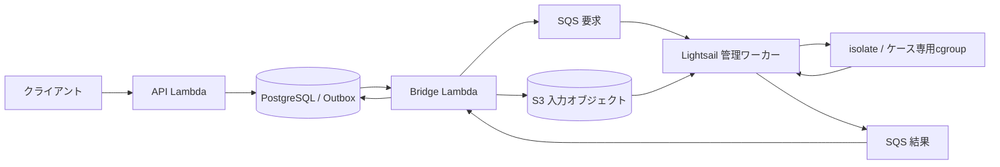

# ジャッジの実行モデル

## 対象範囲

[ADR 0006](../adr/0006-use-lightsail-and-isolate.md)に従い、LightsailのIPv6専用2 GBインスタンスでisolateを直接動かす。
現在の実装はC++17と既存DBの小さなテストセットを対象とする。
他言語と大きなS3バンドルの処理は未実装である。
[構築手順](../../judge/README.md)と[ローカル開発用Dockerワーカー](local-cpp.md)を区別する。

## 処理の流れ

1. APIは提出、問題リビジョン、ランタイム`cpp17-isolate`、runtime digest、制限値を永続化する。
2. BridgeはOutboxをロックし、ソースとテストデータをS3へ保存する。
3. オブジェクトのキー、Version ID、SHA-256、提出ID、試行IDだけを要求キューへ送る。
4. 管理ワーカーは取得したデータのサイズ、チェックサム、識別子、runtime digestを検証する。
5. コンパイル専用isolate環境で一度だけコンパイルし、成果物を管理側へ保存する。
6. ケースごとに新しいisolate環境とcgroupを作り、成果物と入力だけを渡す。
7. 管理側でisolateのメタデータを読み、出力を期待出力と比較して集約する。
8. 作業領域と子孫プロセスを回収し、採点結果を結果キューへ送る。
9. 送信成功後に要求を削除し、Bridgeが試行IDを照合して未確定の結果だけをDBへ反映する。

SQSの要求可視性期限は2,100秒、提出処理の期限は1,800秒とする。
各ケースとコンパイルにも独立した経過時間上限を設ける。
SQSの重複配信で同じ試行が再実行されても、最初に確定した結果を上書きしない。

## 隔離とデータの配置

isolateはUID 60000、ファイルシステム、PID、ネットワークの名前空間とcgroupで提出を隔離する。
提出用ネットワーク名前空間には外部への経路を作らない。
`/usr`などのランタイムは読み取り専用で、ホストの`/etc`は公開せず、最小限のpasswdとgroupを別ディレクトリから渡す。
認証情報、期待出力、計測メタデータ、管理ワーカーのコードはサンドボックスへ渡さない。

コンパイル成果物だけを同じ提出のケース間で共有し、提出終了時に削除する。
各ケースで作業領域とcgroupを作り直すため、前ケースのファイルやプロセスを引き継がない。
共有ランタイムのOSキャッシュやホスト負荷は引き継がれるため、実測値への影響を検証する。

提出と管理処理は同じカーネルを共有する。
カーネル侵害時にはホストの認証情報や期待出力も影響を受け得るため、FirecrackerによるVM隔離と同等とは扱わない。
APIとDBを別環境に置き、LightsailからのVPCピアリングは設定しない。

## 制限と計測

cgroup v2に対応するisolateとLinux 5.19以上を使い、swapを無効にする。
同時実行は1提出とし、コンパイルと実行を重ねない。

| 項目 | 定義と上限 |
| --- | --- |
| CPU時間 | ケースの子孫を含むユーザー時間とシステム時間。100〜5000 msの問題設定を適用 |
| 経過時間 | 待機を含む実時間。CPU時間上限の3倍＋1秒 |
| 最大メモリ | ケース用cgroupのピーク値。子孫と課金されるキャッシュを含み、RSSとは区別 |
| ケース用メモリ | 問題ごとに64〜512 MiB（1 MiB単位） |
| コンパイル | CPU 30秒、経過40秒、メモリ1 GiB |
| ワーカー全体 | メモリ1.5 GiB、128タスク、CPU 1個相当 |
| ファイル領域 | サービス専用tmpfs 512 MiB、16,384 inode |
| 出力 | 標準出力16 MiB、標準エラー64 KiB |

CPU時間と経過時間はms、メモリはbyteで保存する。
コンパイル、入力取得、比較処理はケースのCPU時間に含めない。
必要な計測値が欠けた場合は0で補わず、JEとする。
LightsailのCPU残高と共有ホストの競合によるばらつきは、上記の上限とは別に実機で評価する。

## 判定と障害回収

コンパイル失敗やコンパイル用制限の超過はCEとする。
ケースの判定優先順位はOLE、MLE、TLE、RE、出力比較によるWAまたはACの順とする。
終了コード137やSIGKILLだけではMLEとせず、ケース用cgroupのOOM記録を根拠にする。
ホスト全体のOOM、計測不能、管理処理の障害は提出側のMLEとは区別する。

通常終了と制限超過のどちらでもisolateで清掃する。
清掃に失敗した場合は次のケースへ進まず、ワーカープロセスを終了する。
systemdの`KillMode=control-group`とサービス専用tmpfsにより、再起動前に残存プロセスと作業領域を破棄する。
ホストのOOMなどで結果を送れない場合は、要求の可視性期限切れ後に再配信される。
3回失敗したメッセージはDLQへ移り、作成から6時間経過した未完了提出はdispatch実行時にJEへ確定する。

## 有効化前の検証

2 GBのLightsail実機で、無限ループ、sleep、メモリ超過、大量出力を制限できることを確認する。
ネットワークと秘密ファイルへのアクセス拒否、ケース間の作業ファイル破棄をsmokeで確認する。
子孫プロセスの回収、停止後の再配信、APIから結果保存までの往復も確認する。
OS更新時は指紋を再作成し、smoke後に新しいruntime digestをAPIとワーカーへ反映する。

## 関連する決定

- [ADR 0006](../adr/0006-use-lightsail-and-isolate.md)
- [ADR 0003](../adr/0003-store-test-sets-in-amazon-s3.md)
- [ADR 0004](../adr/0004-use-postgresql-as-primary-database.md)
